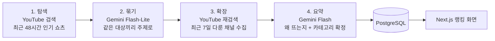

# 왜뜸 (WhyTteum)

> 요즘 이게 왜 유행인지, AI가 대신 알려드려요

유튜브 쇼츠에서 **같은 주제를 다룬 서로 다른 채널이 몇 곳인지**로 유행을 측정하고, Gemini가 "왜 뜨는지"를 요약해 보여주는 개인 프로젝트입니다. 혼자 운영하고 비용을 들이지 않는 것을 조건으로 만들었습니다.

## 주요 화면

| 페이지 | 내용 |
|---|---|
| 메인 `/` | 3일·7일·30일 유행 랭킹. 3일 1위는 AI 요약과 함께 크게 보여주고, 최근 24시간 동안 빠르게 퍼지는 주제는 급상승 배지(`+N`, ⚡)로 표시 |
| 카테고리별 유행 `/categories` | 음식/디저트, 패션/뷰티, 아이템/쇼핑, 밈/챌린지, 음악/댄스, 드라마/예능, 게임, 인물/이슈 8개 카테고리의 랭킹. 카테고리를 고르면 그 카테고리 1위와 1~10위를 보여줌 |
| 주제 상세 `/keyword/[id]` | AI 요약("왜 뜨고 있나요?"), 다룬 채널 수·영상 수·총 조회수, 근거가 된 관련 쇼츠 목록 |

## 랭킹 기준

조회수가 높은 영상 하나가 아니라, **여러 채널로 퍼진 주제**를 유행으로 봅니다.

```
점수 = (다룬 채널 수 + 쇼츠 채널 가중치 0.5) × log10(10 + 총 조회수)
```

- 채널 1곳만 다룬 주제는 랭킹에서 뺍니다.
- 기간(3일·7일·30일)은 영상이 올라온 날을 기준으로 셉니다.

## 수집 파이프라인

cron 워커가 1시간마다 실행합니다. 유튜브 검색은 API 할당량(검색 1회 = 100 units) 때문에 4시간 간격으로만 합니다.



1. **탐색**: 유행·음식·굿즈·음악 등 검색어 8개로 최근 48시간 인기 쇼츠를 모읍니다.
2. **묶기**: Gemini가 영상 제목을 보고 같은 대상(인물·음식·밈 등)끼리 주제로 묶습니다. 정치·사건·스포츠 경기는 제외합니다.
3. **확장**: 상위 주제 6개를 다시 검색해 최근 7일 동안 그 주제를 다룬 채널을 모읍니다. 핵심 카테고리(음식·밈·쇼핑·음악·드라마)를 우선 배정하고, 같은 주제는 12시간 안에 다시 검색하지 않습니다.
4. **요약**: 채널이 많은 주제 10개를 골라 관련 영상 제목 20개를 근거로 "왜 뜨는지"를 요약합니다. 요약은 24시간마다 갱신합니다.

### 카테고리 분류

- AI가 카테고리 이름을 직접 고르면 영상 맥락에 끌려가 틀립니다(가수의 먹방 영상 → 음식/디저트). 그래서 AI는 **대상의 종류**(가수·배우·음식·물건 등)만 고르고, 카테고리 매핑은 코드가 합니다.
- 사람 주제는 **화제가 된 이유**도 함께 판단합니다. 신곡·출연작 같은 활동이면 본업에 맞는 카테고리(가수 → 음악/댄스, 배우 → 드라마/예능)로, 열애·논란 같은 사생활·사건 소식이면 인물/이슈로 분류합니다.
- 회차마다 분류를 덮어쓰지 않고 득표를 쌓아 가장 많이 나온 카테고리를 씁니다. 사람이 직접 고친 분류는 잠가서 AI가 바꾸지 않습니다.

### Gemini 무료 티어 대응

- 호출 사이에 간격을 두고, 분당 한도(429)·서버 혼잡(503)은 15초·45초 뒤 재시도합니다.
- 요약 모델(Flash)의 하루 한도를 넘으면 재시도하지 않고 그 실행 동안 Flash-Lite로 대신 요약합니다.

## 기술 스택

| 영역 | 기술 |
|---|---|
| 웹 | Next.js 16 (App Router, 서버 컴포넌트), React 19, TypeScript, Tailwind CSS 4 |
| 수집 워커 | Node.js, TypeScript (tsx) |
| DB | PostgreSQL 16, Prisma 6 |
| 외부 API | YouTube Data API v3, Gemini API (주제 묶기: Flash-Lite, 요약: Flash) |
| 운영 | Docker Compose (개인 PC), Cloudflare Quick Tunnel |
| CI/CD | GitHub Actions + self-hosted runner |

## 아키텍처

```
[사용자 브라우저]
       │ HTTPS
       ▼
[Cloudflare Quick Tunnel]  ← 포트포워딩·도메인 없이 *.trycloudflare.com 주소로 외부 공개
       │
       ▼
[개인 PC · Docker Compose]
  ├─ web     Next.js. 서버 컴포넌트에서 Prisma로 DB를 직접 조회
  ├─ cron    수집·요약 워커. 시작 시 prisma migrate deploy, 이후 1시간마다 실행
  ├─ db      PostgreSQL (외부에 포트를 열지 않음)
  └─ tunnel  cloudflared
```

web과 cron은 npm workspaces 모노레포에서 같은 Prisma 스키마(`prisma/schema.prisma`)를 공유합니다.

## CI/CD

`.github/workflows/ci.yml`

- **CI** (모든 push·PR): `npm ci` → `prisma generate` → lint → 타입체크 → 빌드
- **CD** (main push만): PC의 self-hosted 러너가 실행
  1. 지금 돌고 있는 이미지를 `:prev` 태그로 백업
  2. `docker compose up -d --build`로 다시 빌드·실행
  3. `localhost:3000` 헬스체크, 실패하면 `:prev` 이미지로 롤백
- API 키는 GitHub에 올리지 않고, 러너가 PC에 있는 `.env`를 복사해서 씁니다.

## 디렉토리 구조

```
whytteum/
├─ apps/
│   ├─ web/                 # Next.js 앱 (화면)
│   └─ cron/                # 수집·요약 워커
├─ prisma/
│   ├─ schema.prisma        # web과 cron이 함께 쓰는 DB 스키마
│   └─ migrations/
├─ docker/
│   ├─ Dockerfile.web       # Next.js standalone 멀티스테이지 빌드
│   ├─ Dockerfile.cron
│   └─ cron-loop.sh         # 시작 시 migrate deploy 후 주기 실행
├─ .github/workflows/ci.yml
├─ docker-compose.yml       # 운영: db + web + cron + tunnel
├─ docker-compose.dev.yml   # 로컬 개발용 PostgreSQL
└─ package.json             # npm workspaces 루트 + Prisma
```

## 로컬 개발

```bash
# 1. 개발용 DB 실행 (Docker Desktop 필요)
docker compose -f docker-compose.dev.yml up -d

# 2. 환경 변수
cp .env.example .env          # 루트: cron과 Prisma가 사용
#    apps/web/.env.local 에도 DATABASE_URL 필요 (Next.js는 앱 폴더의 .env만 읽음)

# 3. 의존성 설치 + DB 스키마 반영 (루트에서)
npm install
npx prisma migrate dev

# 4. 웹 실행 → http://localhost:3000
npm run dev

# 5. 수집 (다른 터미널, 루트에서)
FORCE_DISCOVERY=1 npm run collect   # 4시간 간격 제한을 무시하고 바로 수집
npm run summarize                   # 요약만 다시 만들 때
```

> Windows에서는 개발 서버가 Prisma 엔진 파일을 잡고 있어 `prisma generate`가 실패할 수 있습니다. 스키마를 바꿀 때는 개발 서버를 먼저 끄세요.

## 운영 실행 (Docker)

```bash
docker compose up -d --build                 # db + web + cron + tunnel
docker compose logs tunnel | grep trycloudflare   # 외부 접속 주소 확인
docker compose logs -f cron                  # 수집 로그
docker compose exec -T cron npm run reclassify -w cron   # 기존 주제 카테고리 재분류 (DRY_RUN=1이면 미리보기)
```

- 개발용 DB와는 프로젝트명(`whytteum-prod`)과 볼륨이 분리돼 있어 동시에 띄워도 겹치지 않습니다. 개발 서버가 3000을 쓰고 있으면 `WEB_PORT=3001 docker compose up -d`.
- 외부 접속 주소는 tunnel 컨테이너가 다시 만들어질 때마다 바뀝니다.

## 한계와 다음 개선

- **AI 요약 신뢰도**: 폭로 기사 제목에서 가해자와 피해자를 뒤바꾸는 오류를 완전히 막지 못해, 지금은 "AI 요약은 사실과 다를 수 있어요" 안내로 대응합니다. 요약 검증 단계를 추가하거나 논란 주제는 관련 영상만 보여주는 방식을 고려하고 있습니다.
- **운영 환경**: 개인 PC에서 운영해 PC가 꺼지면 서비스가 멈추고, 외부 접속 주소도 바뀝니다. 라이브 데모가 열리지 않으면 이 때문일 수 있습니다.
- **데이터 출처**: 유튜브 하나만 써서 다른 SNS에서 시작된 유행은 늦게 잡힙니다.
- **채널 수 부풀림**: 같은 소속사·방송사의 여러 채널이 한 주제를 다루면 채널 수가 실제 확산보다 크게 잡힙니다.
